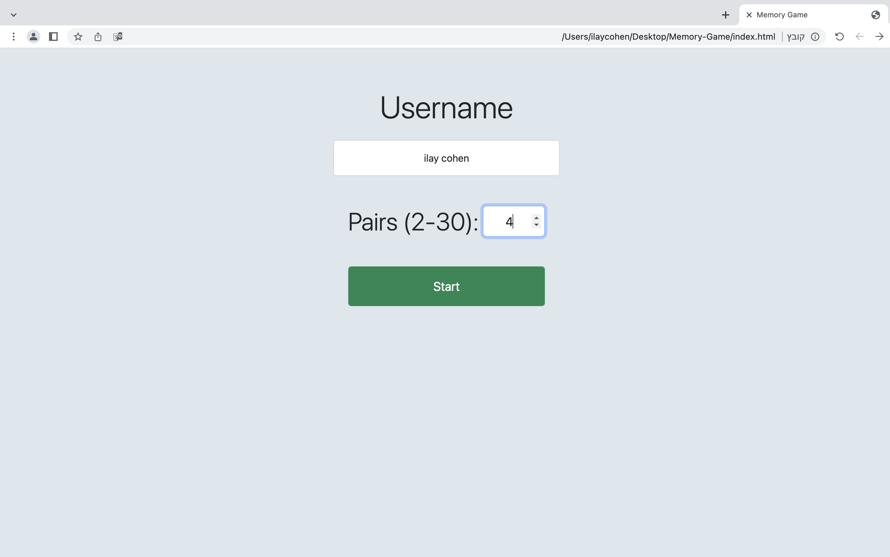
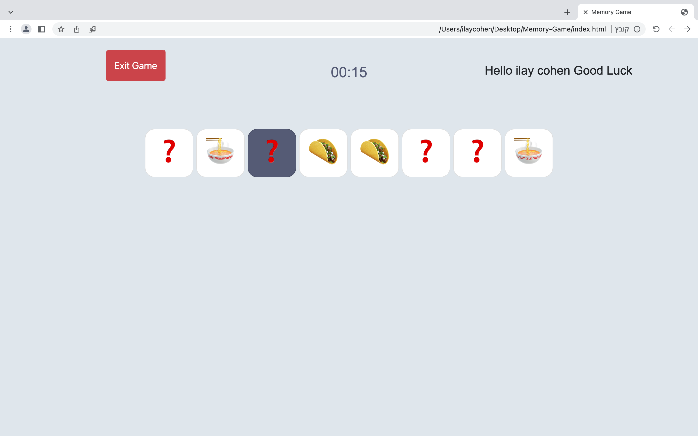
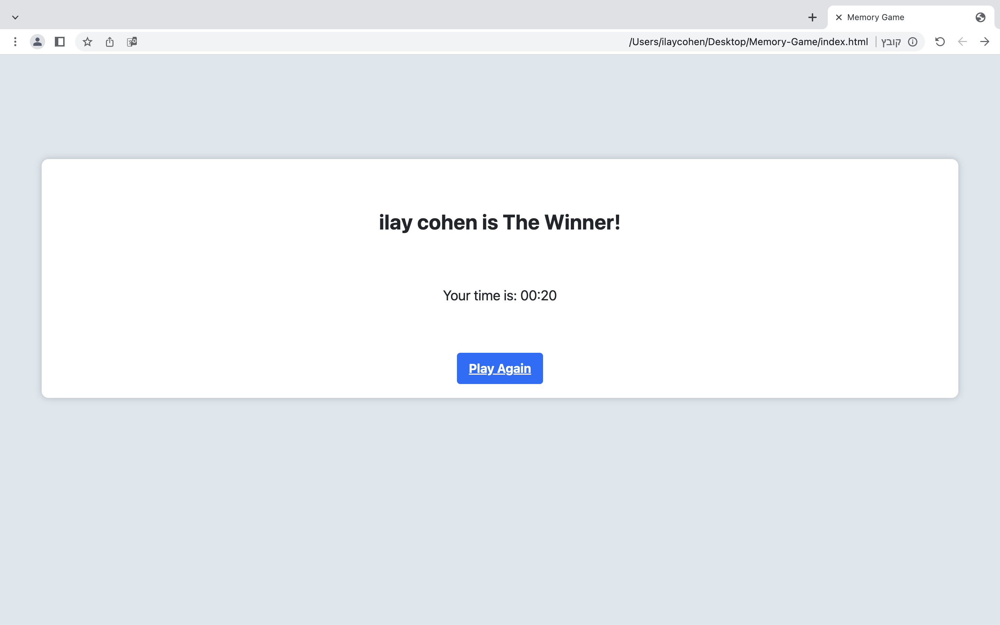

# Memory-Game

Memory Game Card is a web-based game where players test their memory by flipping over pairs of cards to find matching symbols.
Before the game you need to enter your name and number of pairs.

In the game you need to pic 2 cards. if, the cards are the same it will flip and stay open.

After you finish all the pairs it will move to winner page where you will see your name nad your time 


## Features

- Interactive card flipping: Click on a card to reveal its symbol and try to find its match.
- Randomized symbol generation: Symbols on the cards are randomly generated for each game session.
- Timer: Keeps track of the time taken to complete the game.
- Winner notification: Displays the winner's name and time upon successfully matching all the cards.
- Responsive design: Adapts to different screen sizes for an optimal user experience.

## Technologies Used

- HTML
- CSS
- JavaScript

## Usage

1. Clone the repository:

   ```shell
   git clone https://github.com/ilaycohen2712/memory-game-card.git
